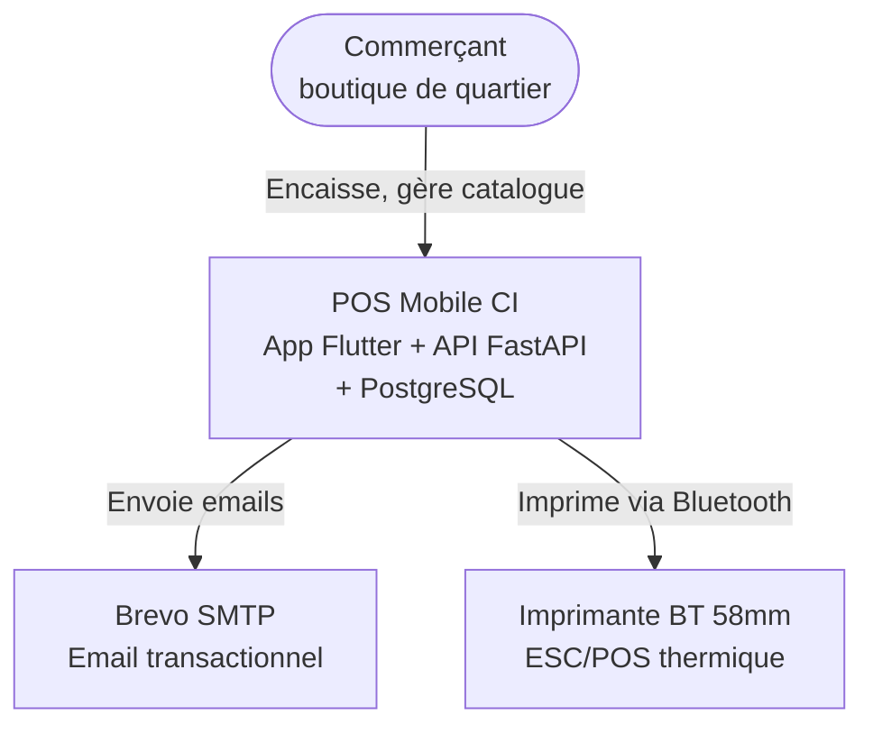
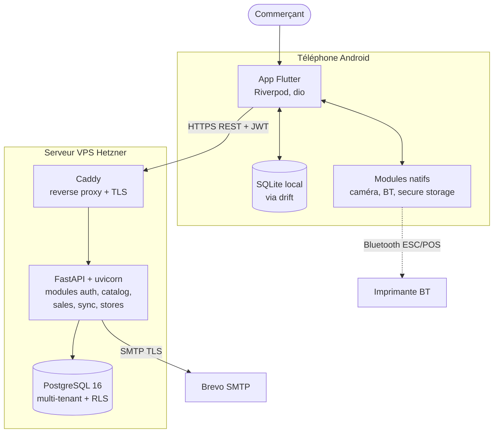
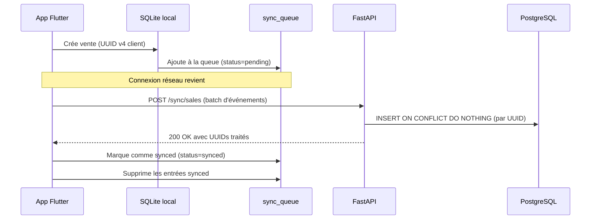
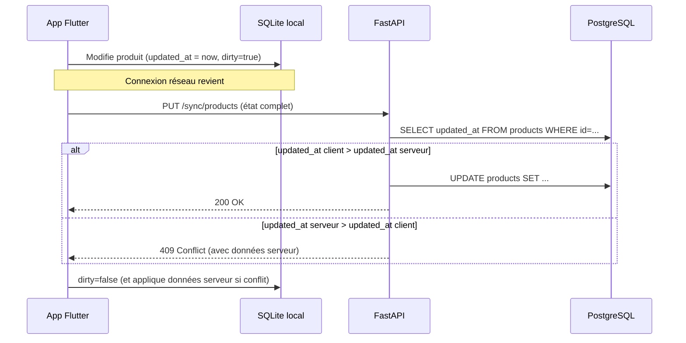

# Architecture

> Document vivant. Dernière mise à jour : 29 avril 2026 — version 1.0.

Ce document décrit l'architecture technique du système POS Mobile CI. Il est destiné à toute personne qui veut comprendre comment le système est construit avant de coder ou d'opérer dessus.

## Sommaire

1. [Vision technique](#vision-technique)
2. [Diagramme de contexte](#diagramme-de-contexte)
3. [Diagramme de conteneurs](#diagramme-de-conteneurs)
4. [Architecture du backend](#architecture-du-backend)
5. [Architecture mobile](#architecture-mobile)
6. [Synchronisation offline-online](#synchronisation-offline-online)
7. [Sécurité](#sécurité)
8. [Déploiement](#déploiement)
9. [Évolutivité et limites](#évolutivité-et-limites)

## Vision technique

Le système est un produit SaaS multi-tenant qui permet à des commerçants en Côte d'Ivoire d'utiliser un smartphone Android comme terminal de point de vente. Trois principes directeurs structurent l'architecture :

1. **Local-first.** Le téléphone est la source de vérité opérationnelle. Le backend est une copie consolidée et un point de synchronisation. Conséquence : l'app fonctionne intégralement sans réseau pendant des heures.
2. **Simplicité opérationnelle.** Une seule personne peut développer, déployer et opérer le système. Aucun choix qui ajouterait du Kubernetes, du Kafka, ou d'autres composants nécessitant une équipe d'ops.
3. **Coût d'infrastructure minimal.** Tout est open source ou utilise des offres gratuites. L'infrastructure tourne pour moins de 10 € par mois jusqu'à plusieurs centaines de commerçants.

## Diagramme de contexte



Le système a un seul acteur principal (le commerçant) et deux dépendances externes : Brevo pour les emails de bienvenue et de récupération de mot de passe, et l'imprimante Bluetooth pour les reçus.

## Diagramme de conteneurs



Le téléphone et le VPS communiquent uniquement via HTTPS. Aucune autre connexion entre les deux. Le téléphone communique aussi en local via Bluetooth avec l'imprimante.

## Architecture du backend

### Style : monolithe modulaire

L'API FastAPI est un seul process déployé. À l'intérieur, le code est organisé en modules métier :

```
backend/app/
├── main.py                  Point d'entrée FastAPI
├── core/                    Config, DB, sécurité, utils transverses
├── modules/
│   ├── auth/                Inscription, connexion, JWT, reset password
│   ├── stores/              Configuration boutique
│   ├── catalog/             CRUD produits
│   ├── sales/               Création de ventes (immuables)
│   └── sync/                Endpoints de synchronisation
└── tests/
```

Chaque module suit la même structure interne :

```
modules/sales/
├── router.py                Routes FastAPI (couche HTTP)
├── service.py               Logique métier
├── repository.py            Accès données (SQLAlchemy)
├── schemas.py               Modèles Pydantic (DTO)
├── models.py                Modèles SQLAlchemy (entités DB)
└── exceptions.py            Exceptions métier spécifiques
```

Cette séparation permet de tester chaque couche indépendamment et facilite l'évolution future vers des microservices si le projet l'exige (très peu probable avant 2-3 ans).

Voir [ADR-0001 : monolithe modulaire](adr/0001-monolithe-modulaire.md) pour la justification de ce choix.

### Communication entre modules

Les modules communiquent uniquement via leurs services exposés, jamais directement via les repositories. Exemple : si le module `sales` a besoin de vérifier qu'un produit existe, il appelle `catalog_service.get_product()`, pas `catalog_repository.find_by_id()`.

Les imports croisés entre modules suivent une règle simple : un module peut importer le `service.py` et `schemas.py` d'un autre, mais jamais ses `repository.py` ou `models.py`.

### Authentification et autorisation

L'authentification est basée sur JWT. Chaque requête authentifiée porte un header `Authorization: Bearer <token>`.

Le token contient un payload minimal :

```json
{
  "sub": "<user_uuid>",
  "store_id": "<store_uuid>",
  "exp": 1735689600
}
```

Le `store_id` est extrait du JWT et injecté dans le contexte de la session PostgreSQL pour activer le Row-Level Security (voir section sécurité).

L'access token a une durée de vie de 1 heure. Un refresh token longue durée (30 jours) permet de renouveler sans ressaisir le mot de passe.

Voir [ADR-0004 : authentification email + PIN](adr/0004-auth-email-pin.md).

## Architecture mobile

### Découpage en couches (clean-ish architecture)

L'app Flutter est organisée en feature-first, avec à l'intérieur de chaque feature une séparation par couches :

```
mobile/lib/
├── main.dart
├── core/                    Config, theme, constantes, erreurs
├── features/
│   ├── auth/
│   │   ├── data/            DataSources (local + remote), repository impl
│   │   ├── domain/          Entities, repository interface, use cases
│   │   └── presentation/    Pages, widgets, providers Riverpod
│   ├── catalog/
│   ├── sales/
│   ├── printing/
│   └── sync/
├── shared/                  Widgets et helpers réutilisés
└── database/                Configuration drift (SQLite local)
```

Le découpage par feature évite la dispersion d'une fonctionnalité dans 4 dossiers différents — quand tu travailles sur les ventes, tout est dans `features/sales/`.

### State management : Riverpod

Tous les états applicatifs passent par Riverpod. Les providers sont organisés par feature et exposés via des fichiers `providers.dart`.

Pourquoi Riverpod plutôt que Provider ou BLoC :

- Type-safety à la compilation (vs Provider)
- Plus simple à apprendre et tester que BLoC
- Excellente intégration avec drift (StreamProviders réactifs sur la DB)
- Permet de tester les use cases sans monter d'UI

### Génération de code

Plusieurs packages Flutter utilisent `build_runner` pour générer du code :

- `drift` : génère les classes de tables et de DAO depuis les classes Dart
- `freezed` : génère les classes immutables (entities) avec `copyWith`, `==`, `hashCode`
- `riverpod_generator` : annotations pour générer les providers
- `retrofit` : génère le client HTTP depuis une classe annotée

Commande à lancer après chaque modification d'un fichier annoté :

```bash
flutter pub run build_runner build --delete-conflicting-outputs
```

Pour le mode watch pendant le développement :

```bash
flutter pub run build_runner watch --delete-conflicting-outputs
```

## Synchronisation offline-online

### Principe hybride

Le système utilise deux modèles de synchronisation différents selon la nature de la donnée :

| Donnée | Modèle | Justification |
|---|---|---|
| Ventes | Événementiel append-only | Les ventes sont immuables (événements comptables). Pas de modification possible après création. |
| Catalogue produit | État avec last-write-wins | Les produits sont mutables (changement de prix, modification de nom). |

Voir [ADR-0003 : synchronisation hybride](adr/0003-sync-hybride.md) pour la justification détaillée.

### Flux de sync ventes (événementiel)



L'idempotence est garantie par le UUID client : si l'app envoie deux fois la même vente (parce que la première réponse a été perdue), le serveur ne crée pas de doublon.

### Flux de sync catalogue (état)



Le last-write-wins basé sur `updated_at` est suffisant pour le MVP (un seul commerçant par compte, modifications concurrentes très rares). En cas de conflit, le client respecte le serveur.

### Pull au démarrage

Au lancement de l'app et à chaque retour en ligne, l'app récupère les changements depuis la dernière sync :

```
GET /sync/changes?since=<timestamp_iso8601>
```

La réponse contient les ventes et produits modifiés côté serveur depuis ce timestamp. Utile principalement pour le scénario "changement de téléphone" où `since=null` pour rapatrier tout l'historique de la boutique.

## Sécurité

### Multi-tenancy avec Row-Level Security

Toutes les tables qui contiennent des données métier ont une colonne `store_id`. Pour garantir qu'aucun bug applicatif ne puisse exposer les données d'une boutique à une autre, PostgreSQL Row-Level Security est activé sur ces tables.

Voir [ADR-0002 : multi-tenancy avec RLS](adr/0002-multi-tenancy-rls.md) pour les détails.

Principe :

```sql
ALTER TABLE products ENABLE ROW LEVEL SECURITY;
CREATE POLICY tenant_isolation ON products
  USING (store_id = current_setting('app.current_store_id')::uuid);
```

À chaque requête authentifiée, le middleware FastAPI extrait le `store_id` du JWT et l'injecte dans la session PostgreSQL :

```sql
SET LOCAL app.current_store_id = '<uuid_extrait_du_jwt>';
```

Toute requête qui tenterait de lire ou écrire sur une autre boutique renverrait zéro lignes ou un échec, indépendamment de ce que le code applicatif demande.

### Stockage des secrets

Aucun secret en dur dans le code ou dans le repo Git. Tout est dans :

- `backend/.env` (jamais committé, présent dans `.gitignore`)
- Variables d'environnement Docker en production

Liste des secrets à gérer :

- `DATABASE_URL` (mot de passe PostgreSQL)
- `JWT_SECRET_KEY` (clé symétrique pour signer les JWT, 32 bytes minimum)
- `BREVO_SMTP_PASSWORD`
- `BACKBLAZE_B2_KEY` (pour les backups)

Pour générer un JWT secret en local :

```bash
python -c "import secrets; print(secrets.token_urlsafe(32))"
```

### Protection contre les attaques courantes

| Attaque | Mitigation |
|---|---|
| Brute force login | Rate limiting via fastapi-limiter (5 tentatives/min/IP) |
| Brute force PIN | Compteur local, 5 tentatives puis blocage 5 min |
| SQL injection | SQLAlchemy avec paramètres bindés, jamais de string concat |
| XSS | Pas de UI web servie par l'API, donc surface réduite |
| CSRF | API stateless avec JWT, pas de cookies de session |
| MITM | TLS forcé (HTTPS uniquement) via Caddy |
| Replay attacks | JWT à courte durée (1h) + refresh token rotatif |

## Déploiement

### Infrastructure cible

- **VPS** : Hetzner CPX11 (4 €/mois, 2 vCPU, 2 Go RAM, 40 Go SSD)
- **OS** : Ubuntu 24.04 LTS
- **Orchestration** : Docker Compose (3 services : caddy, api, postgres)
- **Backups** : pg_dump quotidien chiffré vers Backblaze B2

Voir [ADR-0006 : choix d'hébergement Hetzner](adr/0006-hebergement-hetzner.md).

### Procédure de déploiement

Voir [runbook.md](runbook.md) pour les procédures détaillées.

### Environnements

| Environnement | Usage | Hébergement |
|---|---|---|
| `local` | Développement sur la machine du dev | Docker Compose local |
| `staging` | Tests d'intégration et bêta privée | VPS Hetzner identique à prod |
| `production` | Commerçants payants | VPS Hetzner avec backups |

Au MVP, `staging` et `production` peuvent être le même VPS pour économiser. À séparer dès qu'il y a 50+ utilisateurs.

## Évolutivité et limites

### Capacité estimée de l'architecture actuelle

| Métrique | Limite estimée |
|---|---|
| Commerçants actifs | ~200 sans changement |
| Ventes par jour total | ~20 000 |
| Taille DB après 1 an | ~5 Go |
| Requêtes API simultanées | ~50 |

### À partir de quel volume faut-il évoluer ?

| Symptôme observé | Action recommandée |
|---|---|
| CPU VPS > 70% en moyenne | Passer sur CPX21 (8 €/mois) |
| Latence API > 500ms p95 | Profiler les requêtes lentes, ajouter des index |
| DB > 30 Go | Mettre en place de l'archivage (ventes > 2 ans) |
| > 500 commerçants | Séparer la DB sur un VPS dédié |
| > 2000 commerçants | Envisager un read-replica PostgreSQL |
| > 10000 commerçants | Refonte vers une architecture distribuée |

### Ce qui est explicitement hors-scope du MVP

Ces sujets sont identifiés comme importants mais reportés à des phases ultérieures :

- Plateforme iOS
- Multi-vendeurs par boutique
- Multi-boutiques par compte
- Intégration directe Mobile Money (Wave, Orange, MTN)
- Renouvellement automatique d'abonnement
- Tableaux de bord analytiques avancés
- Application web compagnon (back-office propriétaire)
- Audit log complet (qui a fait quoi quand)
- Synchronisation temps-réel (push via WebSocket)

## Références

- [ADR-0001 : monolithe modulaire](adr/0001-monolithe-modulaire.md)
- [ADR-0002 : multi-tenancy avec RLS PostgreSQL](adr/0002-multi-tenancy-rls.md)
- [ADR-0003 : synchronisation hybride événementiel + état](adr/0003-sync-hybride.md)
- [ADR-0004 : authentification email + PIN](adr/0004-auth-email-pin.md)
- [ADR-0005 : stack Flutter + FastAPI](adr/0005-stack-flutter-fastapi.md)
- [ADR-0006 : choix d'hébergement Hetzner](adr/0006-hebergement-hetzner.md)
- [Modèle de données](data-model.md)
- [Runbook opérationnel](runbook.md)
