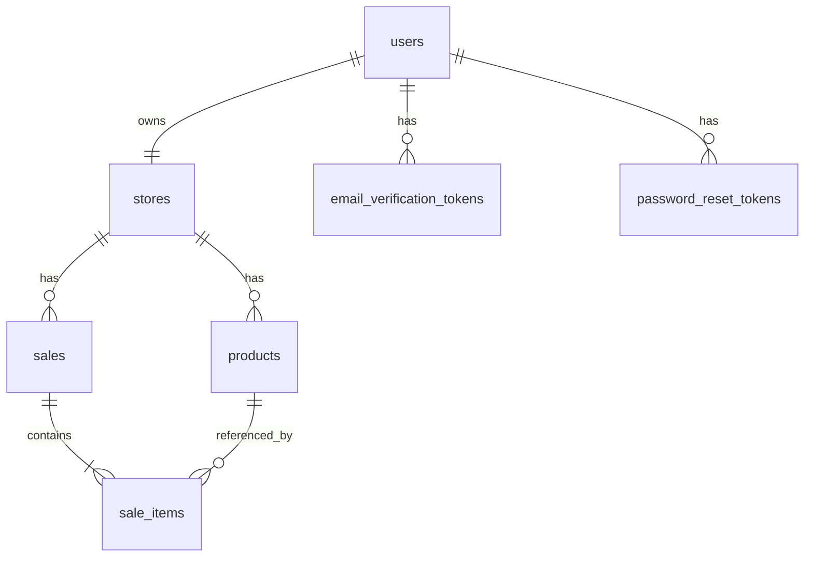

# Modèle de données

> Document de structure (vue d'ensemble). Pour le DDL complet et les justifications détaillées, voir [data-model-detailed.md](data-model-detailed.md).
> Dernière mise à jour : 29 avril 2026 — version 1.0.

Ce document décrit la sémantique des données du système, les entités principales, leurs relations, et les conventions à respecter dans la base PostgreSQL et dans la base SQLite locale.

## Sommaire

1. [Conventions générales](#conventions-générales)
2. [Liste des entités](#liste-des-entités)
3. [Relations entre entités](#relations-entre-entités)
4. [Différences entre base serveur et base locale](#différences-entre-base-serveur-et-base-locale)
5. [Stratégie de migration](#stratégie-de-migration)
6. [TODO pour la phase DDL détaillée](#todo-pour-la-phase-ddl-détaillée)

## Conventions générales

### Identifiants

Toutes les entités utilisent des UUID v4 comme clé primaire. Aucune clé primaire entière auto-incrémentée.

Justification :

- Permet de générer un ID côté client en mode offline sans risque de collision avec d'autres clients
- Empêche l'énumération des ressources via des IDs séquentiels
- Simplifie l'idempotence sur les endpoints de sync

Convention de nommage : la colonne s'appelle toujours `id` dans la table propriétaire, et `<entity>_id` dans les tables qui la référencent (ex: `store_id`, `product_id`).

### Types numériques pour la monnaie

**Toujours utiliser `NUMERIC(12, 2)` pour les montants en FCFA, jamais `FLOAT` ou `REAL`.**

Le FCFA n'a pas de subdivision (pas de centimes en pratique), donc on pourrait être tenté de stocker en entiers. On utilise quand même `NUMERIC` pour anticiper :

- Les exports vers d'autres devises (dollar, euro)
- Les calculs de TVA qui peuvent produire des valeurs non entières intermédiairement
- L'éventualité d'un prix en demi-FCFA (rare mais existe sur certains marchés)

### Horodatage

Toutes les tables ont systématiquement deux colonnes :

```sql
created_at  TIMESTAMPTZ NOT NULL DEFAULT now()
updated_at  TIMESTAMPTZ NOT NULL DEFAULT now()
```

Un trigger PostgreSQL met à jour `updated_at` automatiquement à chaque UPDATE. Pour les ventes (immuables), `updated_at = created_at` toujours.

Pour les entités synchronisées avec le client, on stocke aussi `client_updated_at` qui correspond au `updated_at` côté SQLite local au moment de l'envoi. Sert à arbitrer les conflits last-write-wins.

### Soft delete

Les entités du catalogue (`products` notamment) utilisent un soft delete via une colonne `deleted_at TIMESTAMPTZ NULL`. Quand `deleted_at IS NOT NULL`, l'entité est considérée supprimée.

Justification : préserver l'intégrité de l'historique des ventes. Si on supprime physiquement un produit, les anciennes ventes qui le référencent perdent leur sémantique.

Les ventes (`sales`) ne sont JAMAIS supprimées, ni en hard, ni en soft. Une vente erronée est annulée par une "vente d'annulation" avec un montant négatif (en Phase 2, hors MVP).

### Multi-tenancy : la colonne `store_id`

Toutes les tables qui contiennent des données métier ont une colonne `store_id UUID NOT NULL` qui référence la boutique propriétaire. Cette colonne est :

- **Obligatoire** sur toutes les tables sauf `users`, `stores`, `subscription_plans`
- **Indexée** systématiquement (souvent en index composite avec une autre colonne)
- **Soumise au Row-Level Security PostgreSQL** (voir [architecture.md](architecture.md#multi-tenancy-avec-row-level-security))

### Conventions de nommage SQL

- Tables : pluriel, snake_case, en anglais → `products`, `sales`, `sale_items`
- Colonnes : singulier, snake_case, en anglais → `unit_price`, `created_at`
- Index : `idx_<table>_<colonnes>` → `idx_products_store_id_name`
- Contraintes uniques : `uq_<table>_<colonnes>` → `uq_users_email`
- Foreign keys : `fk_<table>_<table_ref>` → `fk_sale_items_products`
- Politiques RLS : `rls_<table>_tenant_isolation`

## Liste des entités

### Vue d'ensemble

| Entité | Description | Multi-tenant | Synchronisée local |
|---|---|---|---|
| `users` | Comptes utilisateurs (email + password) | Non (global) | Non (serveur uniquement) |
| `stores` | Boutiques (1 par compte au MVP) | Self | Oui |
| `products` | Catalogue produits | Oui | Oui (état last-write-wins) |
| `sales` | Ventes encaissées (immuables) | Oui | Oui (événementiel append-only) |
| `sale_items` | Lignes de chaque vente | Oui | Oui (avec sales) |
| `sync_queue` | File d'attente locale (uniquement SQLite) | n/a | Local uniquement |
| `email_verification_tokens` | Tokens de validation email | Non | Non |
| `password_reset_tokens` | Tokens de reset mot de passe | Non | Non |

### `users` (serveur uniquement)

Comptes globaux. Un utilisateur peut posséder une seule boutique au MVP (relation 1-1 avec `stores`).

Champs principaux :

- `id` — UUID
- `email` — unique, indexé
- `password_hash` — bcrypt (cost 12)
- `phone_number` — pour le support
- `email_verified_at` — TIMESTAMPTZ NULL, NULL tant que pas confirmé
- `created_at`, `updated_at`

### `stores`

La boutique du commerçant. Au MVP, exactement une boutique par utilisateur.

Champs principaux :

- `id` — UUID, sert de `store_id` partout ailleurs
- `owner_id` — FK vers `users.id`, unique (1 boutique par user au MVP)
- `name` — nom commercial
- `address` — texte libre
- `ncc` — Numéro de Compte Contribuable, optionnel
- `vat_subject` — booléen, indique si la boutique est assujettie à la TVA
- `receipt_footer_text` — texte personnalisé sur le bas du reçu (optionnel)
- `created_at`, `updated_at`

### `products`

Catalogue produits d'une boutique.

Champs principaux :

- `id` — UUID
- `store_id` — UUID, FK vers `stores`
- `name` — nom du produit
- `barcode` — optionnel, format EAN-13/8/UPC-A/Code 128
- `unit_price` — NUMERIC(12, 2)
- `current_stock` — INTEGER NULL (NULL = stock non géré)
- `created_at`, `updated_at`, `deleted_at`

Index importants :

- `idx_products_store_id_name` (composite, pour la recherche par nom dans une boutique)
- `idx_products_store_id_barcode` (composite, pour le scan)
- Contrainte unique partielle : `(store_id, barcode) WHERE barcode IS NOT NULL AND deleted_at IS NULL`

### `sales` (immuable)

Une vente encaissée. **Une vente n'est JAMAIS modifiée après création.** Tous les champs sont figés à l'instant de la vente.

Champs principaux :

- `id` — UUID v4 généré côté client (idempotence sync)
- `store_id` — UUID, FK vers `stores`
- `receipt_number` — entier séquentiel par boutique, unique
- `total_amount` — NUMERIC(12, 2), montant TTC
- `vat_amount` — NUMERIC(12, 2), montant TVA (0 si non assujetti)
- `payment_method` — ENUM ('cash', 'mobile_money_orange', 'mobile_money_mtn', 'mobile_money_wave', 'mixed')
- `cash_amount` — NUMERIC(12, 2), pour les paiements mixtes
- `mobile_money_amount` — NUMERIC(12, 2), pour les paiements mixtes
- `created_at` — TIMESTAMPTZ, instant de la vente
- `synced_at` — TIMESTAMPTZ NULL, instant de réception côté serveur

Index importants :

- `idx_sales_store_id_created_at` (composite descendant, pour l'historique)
- Contrainte unique : `(store_id, receipt_number)`

Note critique sur `receipt_number` : ce numéro doit être strictement séquentiel et sans trou pour la conformité DGI. La génération doit être atomique côté serveur. En mode offline, on utilise un format préfixé avec l'identifiant device pour distinguer (à confirmer avec un expert-comptable, voir [TODO](#todo-pour-la-phase-ddl-détaillée)).

### `sale_items`

Lignes individuelles d'une vente. Une vente a 1 à N lignes.

Champs principaux :

- `id` — UUID
- `sale_id` — FK vers `sales`
- `store_id` — UUID, dénormalisé pour le RLS
- `product_id` — UUID, FK vers `products` (peut référencer un produit soft-deleted)
- `product_name_at_sale` — copie du nom au moment de la vente (immuabilité)
- `unit_price_at_sale` — NUMERIC(12, 2), copie du prix au moment de la vente
- `quantity` — INTEGER NOT NULL
- `line_total` — NUMERIC(12, 2), calculé `quantity * unit_price_at_sale`

La dénormalisation de `product_name_at_sale` et `unit_price_at_sale` est délibérée : elle garantit que l'historique des ventes reste lisible même si le produit est ensuite supprimé ou son prix modifié.

### `sync_queue` (SQLite local uniquement)

Cette table n'existe QUE côté SQLite local, jamais côté PostgreSQL serveur.

Champs principaux :

- `id` — INTEGER auto-incrémenté
- `entity_type` — TEXT ('sale' au MVP)
- `entity_id` — TEXT (UUID de l'entité concernée)
- `payload` — TEXT (JSON sérialisé de l'événement)
- `status` — TEXT ('pending', 'syncing', 'synced', 'failed')
- `retry_count` — INTEGER
- `last_error` — TEXT NULL
- `created_at`, `last_attempt_at`

### `email_verification_tokens` et `password_reset_tokens`

Tables utilitaires pour les workflows d'email transactionnel.

Champs communs :

- `id` — UUID
- `user_id` — FK vers `users`
- `token_hash` — hash du token (le token clair est envoyé par email)
- `expires_at` — TIMESTAMPTZ
- `used_at` — TIMESTAMPTZ NULL (token à usage unique)

## Relations entre entités



Cardinalités :

- Un utilisateur possède exactement une boutique (1-1, contrainte d'unicité sur `stores.owner_id`)
- Une boutique a 0 à N produits
- Une boutique a 0 à N ventes
- Une vente contient 1 à N lignes (`sale_items`)
- Un produit peut être référencé par 0 à N lignes de vente

## Différences entre base serveur et base locale

| Aspect | PostgreSQL serveur | SQLite local (drift) |
|---|---|---|
| Tables | Toutes sauf `sync_queue` | Toutes sauf `email_verification_tokens` et `password_reset_tokens` |
| RLS | Activé sur les tables tenant | Pas pertinent (1 utilisateur par DB) |
| Triggers `updated_at` | Triggers PL/pgSQL | Géré dans le code Dart via dao.update() |
| Types numériques | NUMERIC(12, 2) | TEXT pour préserver la précision (drift recommande de stocker en string puis convertir en Decimal) |
| Contraintes | Strictes (FK, CHECK) | Mêmes contraintes répliquées |
| Index | Tous les index | Mêmes index pour assurer les mêmes performances |

Important : la définition des tables doit rester proche entre les deux côtés. Tout champ ajouté côté serveur doit être ajouté côté local dans la même migration logique.

## Stratégie de migration

### Côté serveur (PostgreSQL)

Outil : Alembic.

Convention :

- Une migration par fonctionnalité, pas une grosse migration "init"
- Toujours tester `alembic upgrade head` ET `alembic downgrade -1` avant commit
- Les migrations contenant du SQL spécifique RLS sont écrites manuellement (Alembic ne détecte pas ces changements)

Structure des fichiers de migration :

```
backend/alembic/versions/
├── 2026_05_01_init_users_stores.py
├── 2026_05_03_add_products.py
├── 2026_05_05_add_sales_sale_items.py
├── 2026_05_07_enable_rls_on_tenant_tables.py
└── ...
```

### Côté mobile (drift / SQLite)

Outil : système de migrations intégré à drift.

Convention :

- Numéro de schéma incrémenté à chaque changement de structure
- Implémenter `MigrationStrategy` avec `onUpgrade` qui gère chaque transition de version
- Tester systématiquement sur une DB existante avant de releaser une nouvelle version

## TODO pour la phase DDL détaillée

✅ **Cette phase est terminée.** Voir [data-model-detailed.md](data-model-detailed.md) pour le DDL complet et la migration `backend/alembic/versions/0001_initial_schema.py` pour son implémentation.

### Décisions prises (issues de la discussion PO/dev)

- ✅ Format du `receipt_number` : INTEGER séquentiel par boutique, généré par trigger PostgreSQL atomique côté serveur. Conséquence métier : en mode offline, le reçu papier doit afficher "En attente de N° fiscal" et être réimprimé après sync.
- ✅ Stockage des montants : `NUMERIC(12, 2)` partout
- ✅ Suppression users/stores : hard delete avec `ON DELETE RESTRICT` + procédure d'anonymisation manuelle pour le RGPD
- ✅ Pas d'audit log au MVP (à reconsidérer en Phase 2)
- ✅ Soft delete sur `products` uniquement (préservation historique des ventes)
- ✅ Dénormalisation de `store_id` sur `sale_items` pour RLS efficient

### Reste à faire (hors DDL)

- [ ] Validation juridique du format du reçu DGI par un expert-comptable ivoirien
- [ ] Stratégie de purge des `sync_queue` côté local (à définir lors de l'implémentation Flutter)
- [ ] Décision sur la conservation de l'historique des prix (`product_price_history`) — reportée en Phase 2 par défaut
